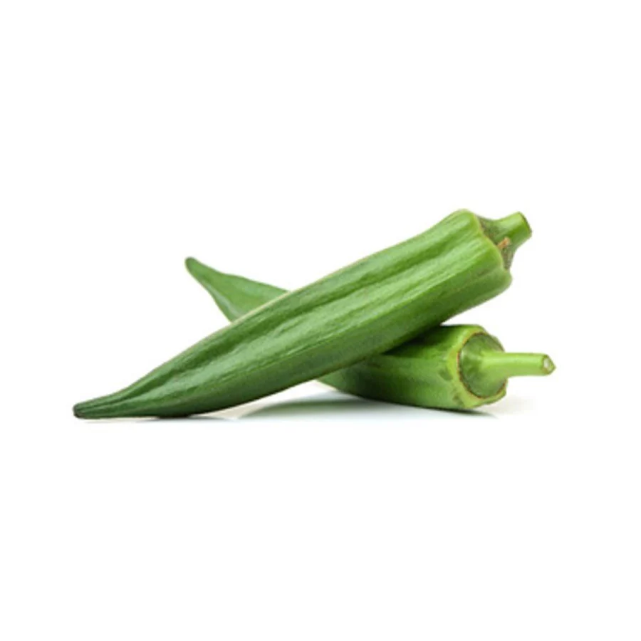
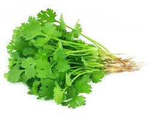
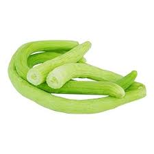
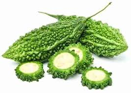
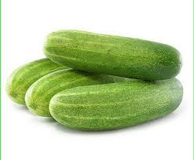
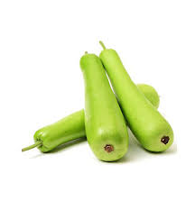
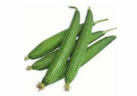
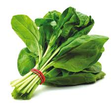
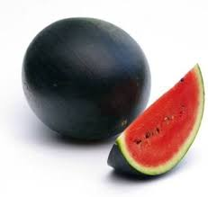

# Organic Farming

Welcome to my organic farming journey!

## Here is what I have planted in my farm

1. [Bhindi](https://iamtushara.github.io/organic-farming/bhindi)  
   

2. [Dhaniya](https://iamtushara.github.io/organic-farming/dhaniya)  
   

3. [Kakdi](https://iamtushara.github.io/organic-farming/kakdi)  
   

4. [Karela](https://iamtushara.github.io/organic-farming/karela)  
   

5. [Kheera](https://iamtushara.github.io/organic-farming/kheera)  
   

6. [Lauki](https://iamtushara.github.io/organic-farming/lauki)  
   

7. [Nenua](https://iamtushara.github.io/organic-farming/nenua)  
   

8. [Palak](https://iamtushara.github.io/organic-farming/palak)  
   

9. [Tarbooj](https://iamtushara.github.io/organic-farming/tarbooj)  
   
